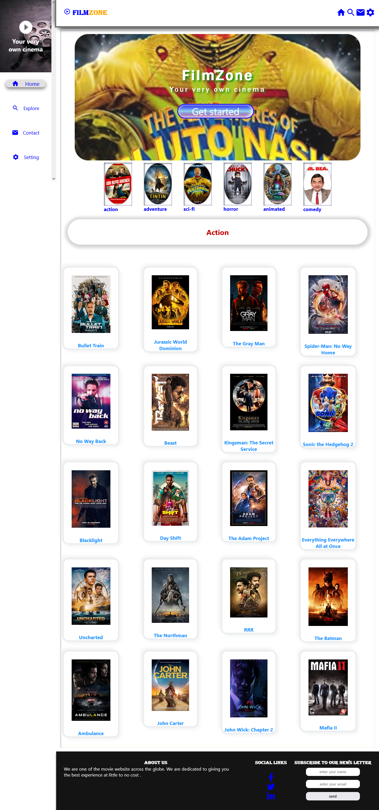

# Film Zone

## Getting started
   This project is a movie website which does the following
- Display movies based on different genre(eg action,adventure,animated etc)
- Allow users to search for movies by title
- Display a details page for each movie result when the user clicks on the movie
- Allow users to send their feedback through a contact form which is linked to an email account
- Provides light and darkmode themes

### prerequisites
    In order to use this website,please ensure you have the following
1. A browser eg chrome,firefox or safari
2. A stable internet connection

### Installation
    In order to install this project on your localhost, run the following command in your command line terminal
> git clone https://github.com/Tomiloba2/FilmZone.git
> npm install

The above commands allow you to clone the project into your computer and install the neccessary dependencies

### Live preview
   You can view the livesite by clicking on the link below
   [FilmZone](https://)

## Project dependencies
    The entire project was built on `create react app` and styled with `CSS`

## Running Test
   You can test the functionality of the site in two different ways
### Unit Test
   Carry out the following test
1. Click on each navigation link to ensure that it links to the right page
2. Search for a movie on the explore search bar to check if it works as intended
3. fill in a feedback in the contact form in order to check if it works properly
### Integration test
1. Resize the viewport to ensure that the site is fully responsive
2. Click on a movie to make sure it routes to its details page

## ScreenShot
  This is a screen shots of the home page
  

## Contributing
   Contributions are very much welcomed.
   If interested, create a fork and make changes

## LICENSE
> MIT License

## Acknowledment
  I give thanks to everyone that supported the project and will still surpoert it in the future.
  Thank You

